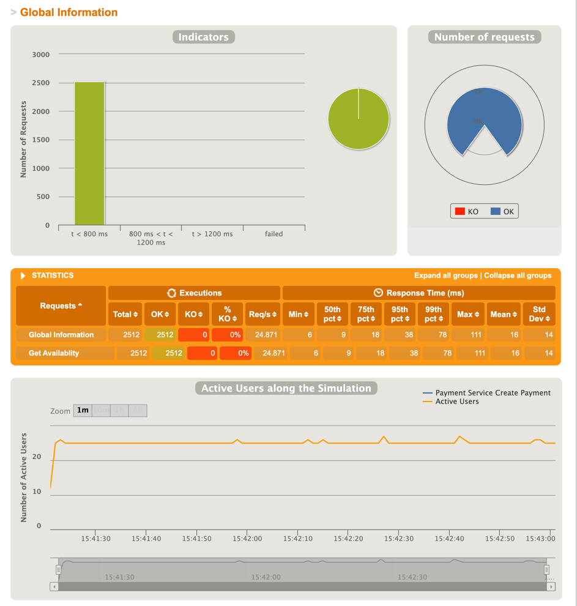
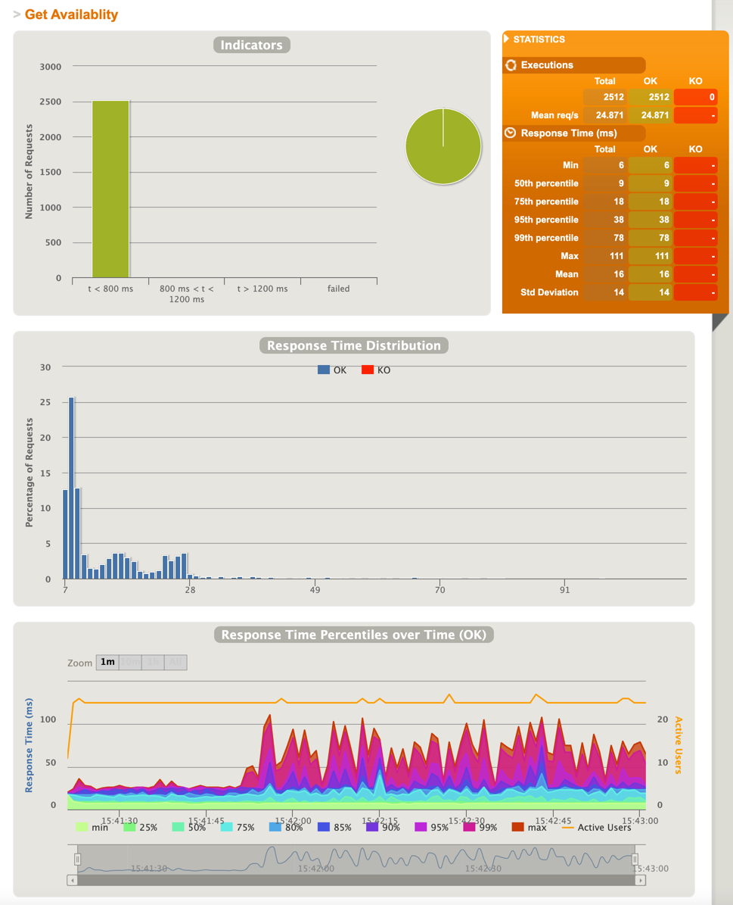
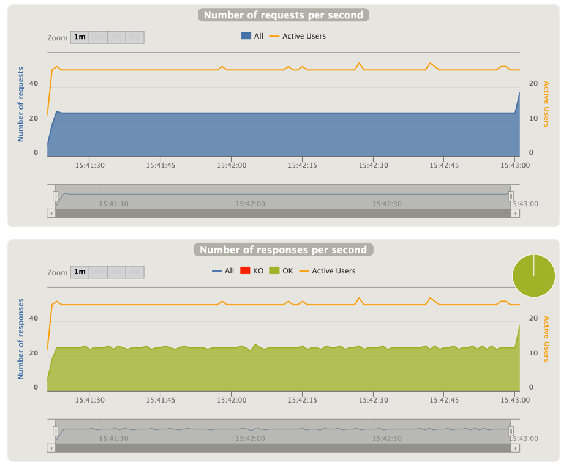

# upgrade-code-challenge
## Problem statement

### Back-end Tech Challenge: Campsite reservation REST API service

An underwater volcano formed a new small island in the Pacific Ocean last month. All the conditions on the island seems perfect, and it was decided to open it up for the public to experience the pristine uncharted territory.

The island is big enough to host a single campsite so everybody is very excited to visit. In order to regulate the number of people on the island, it was decided to come up with an online web application to manage the reservations. You are responsible for design and development of a REST API service that will manage the campsite reservations.

To streamline the reservations a few constraints need to be in place

- The campsite will be free for all.
- The campsite can be reserved for max 3 days.
- The campsite can be reserved minimum 1 day(s) ahead of arrival and up to 1 month in advance.
- Reservations can be cancelled anytime.
- For sake of simplicity assume the check-in & check-out time is 12:00 AM

### System Requirements

- The users will need to find out when the campsite is available. So the system should expose an API to provide information of the availability of the campsite for a given date range with the default being 1 month.
- Provide an end point for reserving the campsite. The user will provide his/her email & full name at the time of
  reserving the campsite along with intended arrival date and departure date. Return a unique booking identifier back to the caller if the reservation is successful.
- The unique booking identifier can be used to modify or cancel the reservation later on. Provide appropriate end
  point(s) to allow modification/cancellation of an existing reservation
- Due to the popularity of the island, there is a high likelihood of multiple users attempting to reserve the campsite for the same/overlapping date(s). Demonstrate with appropriate test cases that the system can gracefully handle concurrent requests to reserve the campsite.
- Provide appropriate error messages to the caller to indicate the error cases.
- In general, the system should be able to handle large volume of requests for getting the campsite availability.
- There are no restrictions on how reservations are stored as long as system constraints are not violated.

# Campsite reservation service
This micro-service is used to book a reservation for a campsite at the underwater volcano in the Pacific Ocean.

## Prerequisites

* Java 11
* Gradle 7.3

## Gradle build

This application uses Gradle as a build tool. The table below demonstrates some commands available.
To get a complete list of commands, execute ```./gradlew tasks --all```.

| Command | Description  |
| ------- | --- |
| ```./gradlew clean``` | Deletes the build directory.|
| ```./gradlew build``` | Assembles and tests this project.|

For a simple, one-liner build,
`./gradlew clean build`

# Run Locally
To run the application locally, you can do it from IntelliJ or the command line.

- From command line:
    - `./gradlew bootRun` (This is using gradle's built-in )

#Solution
The campsite reservation service exposes 4 endpoints. API contract can be accessible with the following URL.

`http://localhost:8080/swagger-ui/index.html`

## Database design
For now, the campsite has only one campsite for the reservation but the system is designed in a way that it can be easily adjusted to work for more than one campsite in the future.  
There are 3 tables to hold the reservation information.
1) `camp_sites`: This table stores the campsite information. Since we have only one campsite at this moment, it contains one hardcoded data. In the future, the service can be enhanced to expose APIs related to campsite management.
2) `reservations`: This table stores the reservation information and customer information. To be able to make a reservation, campsite, customer, and arrival/departure information is needed. The reservation table has many to one relationship to `camp_sites` table.
3) `reserved_dates`: This table stores the normalized reservation dates. This table has one unique constraint. It expects to have only one entry for each campsiteId, and reserved date. In simple words, each campsite can be reserved for one day only. The `reserved_dates` table has many to one relationship to the `reservations` table.

## Create reservation API
`POST http://localhost:8080/api/v1/reservation`

This endpoint is to create a reservation at the campsite. It requires user information like email address and full name. In addition to that, it needs information about arrival and departure date to create a reservation. The reservation will be stored in the two tables(`reservations` and `reserved_dates`). Before creating a reservation there will be a validation to check if the dates are available. If the dates are available the system will try to create a reservation. The system will use a database constraint to handle concurrent create requests. If there are concurrent requests with the same or overlapping dates then either one will be successful and other requests will fail with the appropriate exception message.

## Update reservation API
`PATCH http://localhost:8080/api/v1/reservation/{reservationId}`

This endpoint is to update existing reservations at the campsite. It requires the reservation id which can be found from the create reservation API response. Before updating the reservation, the system will fetch the existing reservation data from the DB and put the `pessimistic` locking on the record. If we have concurrent update or cancellation requests for the same reservation then only one will be able to acquire the database lock and other requests will fail with the appropriate failure message. If the new reservation dates are not available then the system will roll back the update and the request fails with the appropriate message.

## Get reservation API
`GET http://localhost:8080/api/v1/reservation/{reservationId}`

This endpoint is to get existing reservations at the campsite. It requires the reservation id which can be found from the create reservation API response. This API filters out canceled reservation. This will return not found error if the reservation id is wrong. 

## Cancel reservation API
`DELETE http://localhost:8080/api/v1/reservation/{reservationId}`

This endpoint is to cancel the reservation at the campsite. It requires the reservation id which can be found from the create reservation API response. Before canceling the reservation, the system will fetch the existing reservation data from the DB and put the `pessimistic` locking on the record. If we have concurrent update or cancellation requests for the same reservation then only one will be able to acquire the database lock and other requests will fail with the appropriate failure message. If the cancellation request is successful then the system will update the reservation entry with the cancellation date and time. In addition to that, the system will open up the canceled date for the reservation by deleting reserved data information from `reserved_dates` table.

## Get availability of the campsite API
`GET http://localhost:8080/api/v1/reservation/availableDates`

This endpoint is to find the availability of the campsite for a given date range. It works without any date range in the request, when no range is provided it returns the availability within one month.

# Solution to the system requirements

### Due to the popularity of the island, there is a high likelihood of multiple users attempting to reserve the campsite for the same/overlapping date(s). Demonstrate with appropriate test cases that the system can gracefully handle concurrent requests to reserve the campsite.

`ReservationControllerTest` has APIs tests to test this scenario. Specifically `testConcurrentCreateReservationForSameDate`, `testConcurrentCreateReservationForOverlappingDates`, `testConcurrentCreateReservationForDifferentDate` and `testConcurrentUpdateReservationAndCreateReservationForSameDate` tests.

These API tests demonstrate that system is capable of handling concurrent requests gracefully and provides an appropriate error message to the caller.

### In general, the system should be able to handle a large volume of requests for getting the campsite availability.

Used Gatling script to do the load testing of the get availability API. Below is the load testing configuration.
- Total request sent: 2512
- No of concurrent requests: 50
- Total number of concurrent users: 25

**Result:**

- All the requests were successful.
- Average response time was 16ms.
- Maximum response time was 111ms.
- p95 of the requests was 38ms.





